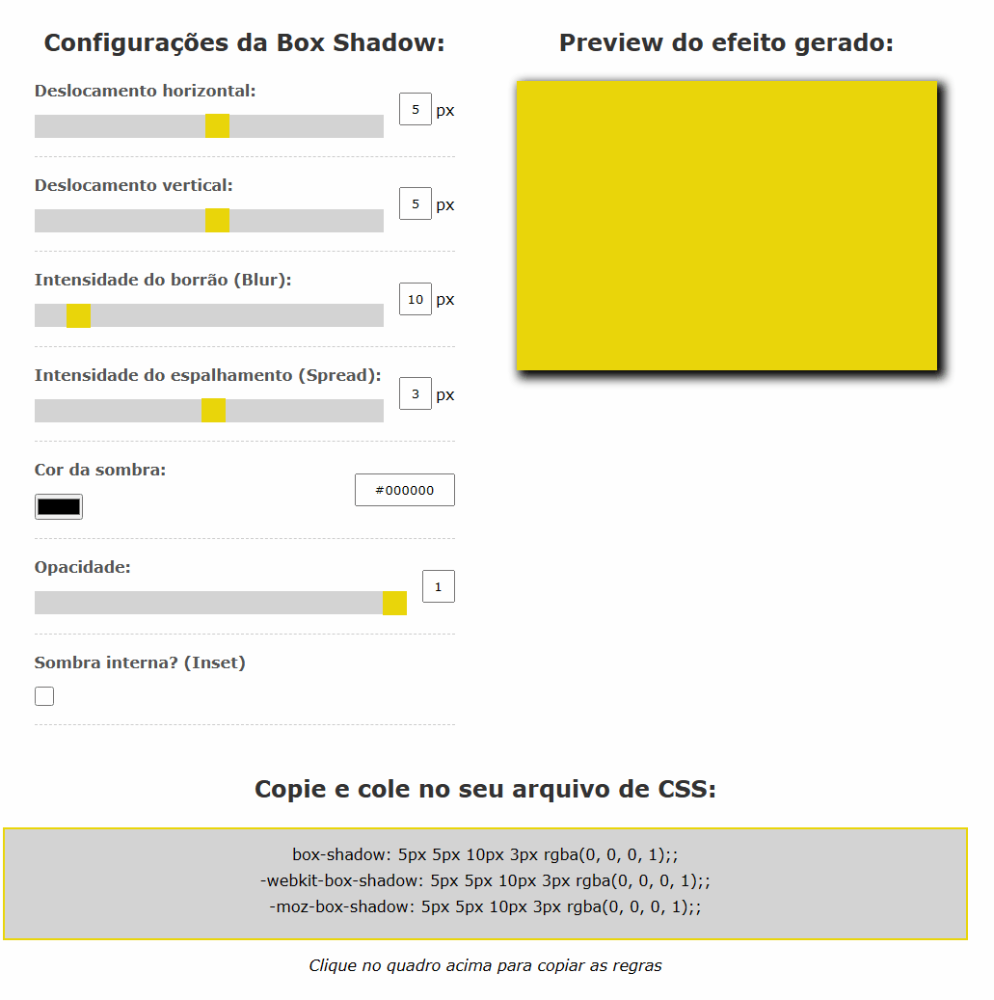
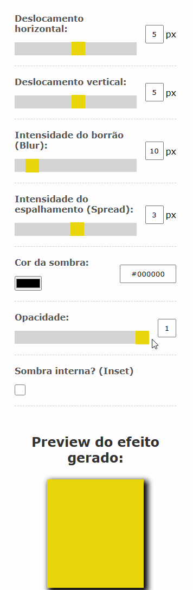

# Gerador Box Shadow 🎨

* Box Shadow 👥
    * Projeto com intuito de gerar vários tipos de sombra
    * Gerador de código CSS para copiar e colar onde quiser
    * Paleta de cores para modificar a sombra
#

Deploy Netlify ☁️:

[Box Shadow Generator 🎨](https://boxshadowgenerator-bn.netlify.app/)

#

* Stacks 📚 and Skills 🧠:

    * HTML
        * Tags Semânticas
    * CSS
        * Flex-Box
        * Media Query        
    *  JavaScript 
        * DOM
        * Classe
        * Eventos
        * Funções
        * Regex
#

<h3>Page 📑:</h3>

#

<h3>Responsive 📲:</h3>

